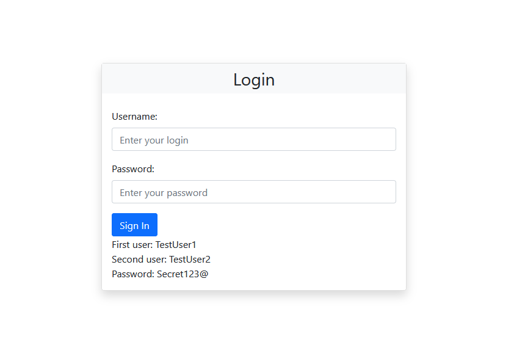
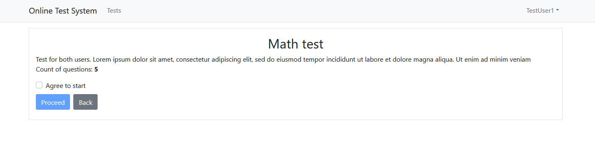
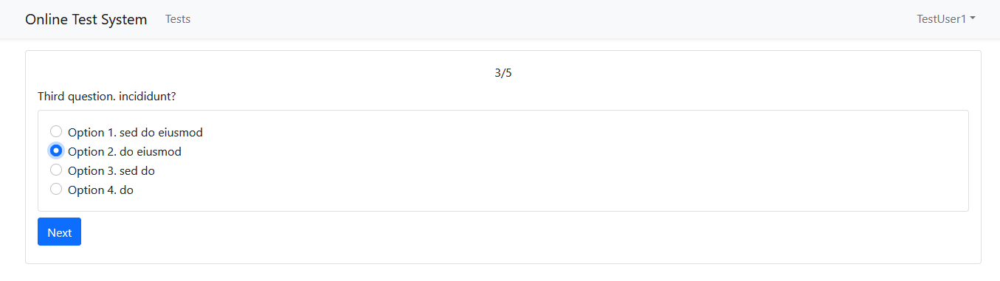
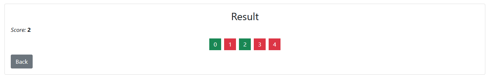

# Online Test System

## About
Test task

## Setup
This is an short description how you can run and test locally. 
After starting the server, you can view the result: http://localhost:3000
### With Docker
```
docker compose up -d
```
### Without Docker
It is necessary to specify the database connection string (postgresql) in the appsettings.json
```
"ConnectionStrings": {
    "DefaultConnection": "Host=localhost;Port=5432;Database=testsdb;Username=postgres;Password=secret"
  }
```
Or you can use sql server localdb. To do this you need use sqlserver-localdb branch and if you need to change the connection string then edit appsetting.json
```
"ConnectionStrings": {
    "DefaultConnection": "Server=(localdb)\\mssqllocaldb;Database=testdb;Trusted_Connection=True;"
  }
```
---
Run server
```
dotnet run
```
Run client
```
npm start
```

## Examples

Login page:



Test detail page:



Question page:



Result page:


